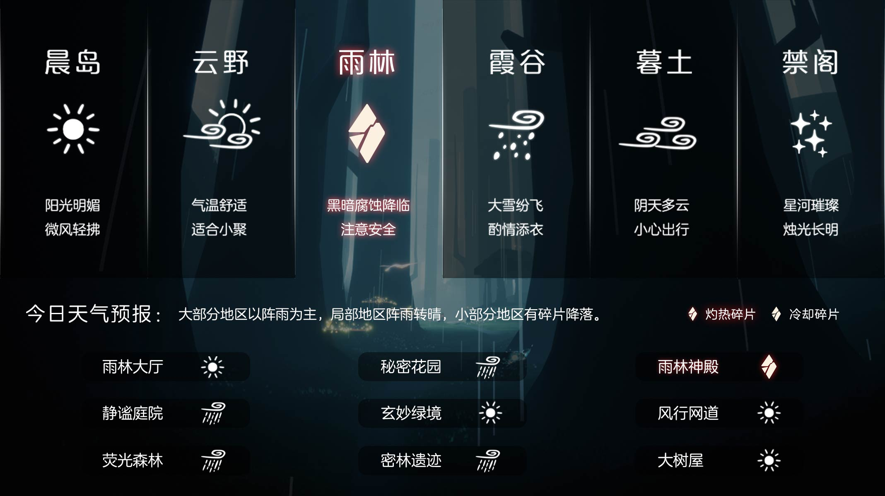
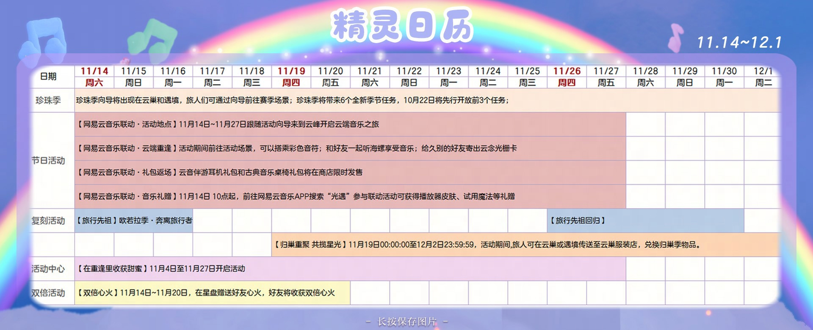
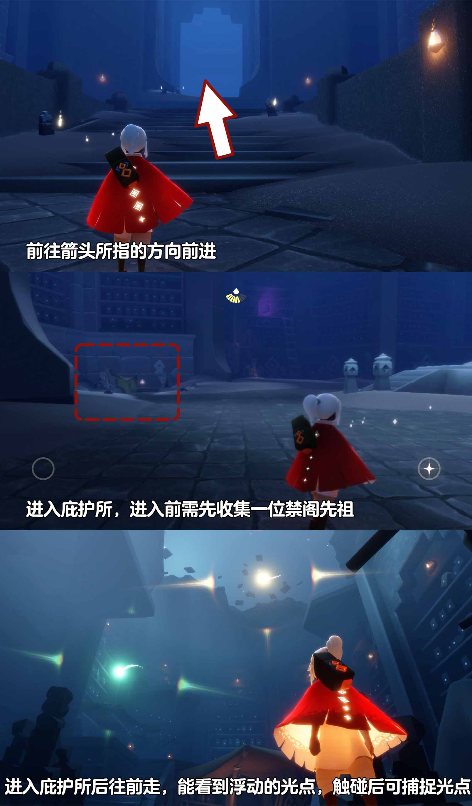

# 🌤 光遇每日任务

[](https://github.com/oivio-up/SkyDailyInfo/actions/workflows/update-daily.yml)

自动获取并展示《光·遇》每日任务和活动信息。

**[打开每日旅行手册 →](https://oivio-up.github.io/SkyDailyInfo/)** · 支持手机浏览、任务勾选、天气与图片攻略。

## 💡 项目说明

本项目通过 **Cloudflare Worker** 中转 API 请求，使用 **GitHub Actions** 每日自动更新，将光遇的每日任务和活动信息展示在 README 中。

### 特性

- ✨ 每日自动更新任务和活动信息
- 🔒 敏感数据（UID、Token）安全存储在 Cloudflare
- 🚀 通过 Cloudflare Worker 中转 API，保护隐私
- 📱 清晰的任务和活动展示
- 🖼️ 图片保存到仓库，避免外链代理失效
- ⏰ 北京时间每天 8:00 自动更新

---

<!-- DAILY_TASK_START -->
## 📅 2026年11月14日 每日任务

> 最后更新: 2026年11月14日 12:58:36 (北京时间)

### 🎯 今日旅行指南

```
【今日旅行指南】
1. 向一位玩家鞠躬
2. 和朋友击掌
3. 掀翻5只螃蟹
4. 在禁阁的庇护所中捕捉3个光点
```

### 🌤️ 天气预报

天气播报：大部分地区地区夜间晴朗，雨林神殿将会有灼热碎片降落




### 📅 本月日历




### 📖 任务详细攻略


#### 📍 掀螃蟹攻略

【掀螃蟹】
在螃蟹周围长按角色，发出呐喊，即可掀翻周围的螃蟹哦。
走近被掀翻的螃蟹，会出现小图标，点击就可以抓起螃蟹啦~
 今日推荐：缀珠礼服20套染色穿搭参考https://ds.163.com/feed/6adf9b60446a4f1a707246c6/?utm_content=f_ma75.jl.jlctPT.top.jz9w5q&utm_term=wyds_dl_jl_sky3_5cb546a0d5456870b97d9424&utm_bothash=ma75_bot_367bc25a42d1935a6e04c90df3bd91be&q=掀螃蟹攻略


---


#### 📍 每日任务-在禁阁的庇护所中捕捉浮动的光点

【在禁阁的庇护所中捕捉浮动的光点】
1、前往禁阁大厅，进入庇护所
2、进入庇护所后往前走，浮动的光点就在前方飞
3、触碰后可捕捉光点
小精灵提醒您：
1、进入庇护前所需要收集一位禁阁常驻先祖
2、需要收集三个光点
3、在收集过程中若光点消失，旅人可尝试重新进入地图
图片指引：
视频攻略：
https://ok.166.net/gameyw-gbox/bot/205/20260602/919392b7a3b7551d676e57f0601985813868d58a.mp4
今日推荐：在禁阁的庇护所中捕捉浮动的光点-视频指引https://ds.163.com/feed/6972cce3d085d23f35829c38?utm_content=f_ma75.jl.jlctPT.default.a146im&utm_term=wyds_dl_jl_sky3_5cb546a0d5456870b97d9424&utm_bothash=ma75_bot_367bc25a42d1935a6e04c90df3bd91be&q=每日任务-在禁阁的庇护所中捕捉浮动的光点





---


#### 📍 季节蜡烛探索指南

https://h5.ds.163.com/v1/6ad585a083a764003172a423/?utm_content=f_ma75.jl.jlct.default.9v9w70&utm_bothash=ma75_bot_367bc25a42d1935a6e04c90df3bd91be


---


### 🎪 今日活动

今日暂无特殊活动

---

<!-- DAILY_TASK_END -->
