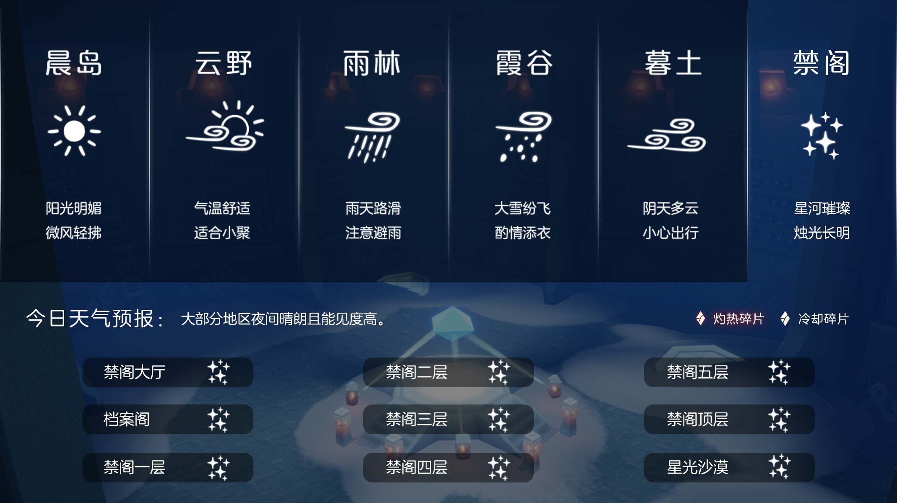

# 🌤 光遇每日任务

[](https://github.com/oivio-up/SkyDailyInfo/actions/workflows/update-daily.yml)

自动获取并展示《光·遇》每日任务和活动信息。

**[打开每日旅行手册 →](https://oivio-up.github.io/SkyDailyInfo/)** · 支持手机浏览、任务勾选、天气与图片攻略。

## 💡 项目说明

本项目通过 **Cloudflare Worker** 中转 API 请求，使用 **GitHub Actions** 每日自动更新，将光遇的每日任务和活动信息展示在 README 中。

### 特性

- ✨ 每日自动更新任务和活动信息
- 🔒 敏感数据（UID、Token）安全存储在 Cloudflare
- 🚀 通过 Cloudflare Worker 中转 API，保护隐私
- 📱 清晰的任务和活动展示
- 🖼️ 图片保存到仓库，避免外链代理失效
- ⏰ 北京时间每天 8:00 自动更新

---

<!-- DAILY_TASK_START -->
## 📅 2026年11月02日 每日任务

> 最后更新: 2026年11月02日 12:30:01 (北京时间)

### 🎯 今日旅行指南

```
【今日旅行指南】
1. 点亮一位玩家
2. 点燃20根蜡烛
3. 和朋友击掌
4. 帮助忙碌舞台管理员
```

### 🌤️ 天气预报

天气播报：今日无碎片降落




### 📅 本月日历


### 📖 任务详细攻略


#### 📍 帮助忙碌舞台管理员

【每日任务－帮助忙碌舞台管理员】
请旅人先查看接到的任务名称，然后在下方选择对应指南
在圆梦村剧场找到忙碌舞台管理员　｜　忙碌舞台管理员在圆梦村剧场需要你的帮助
小精灵提示：
1、若旅人从未收集过该先祖，任务会显示为：在圆梦村剧场找到忙碌舞台管理员；
2、若旅人之前已收集过该先祖，任务会显示为：忙碌舞台管理员在圆梦村剧场，需要你的帮助
今日推荐：小恶魔斗篷礼包染色穿搭参考https://ds.163.com/feed/6add0bfd99f09836c90a60b1/?utm_content=f_ma75.jl.jlctPT.top.uz1bce&utm_term=wyds_dl_jl_sky3_5cb546a0d5456870b97d9424&utm_bothash=ma75_bot_367bc25a42d1935a6e04c90df3bd91be&q=帮助忙碌舞台管理员


---


#### 📍 季节蜡烛探索指南

https://h5.ds.163.com/v1/6ad585a083a764003172a423/?utm_content=f_ma75.jl.jlct.default.9v9w70&utm_bothash=ma75_bot_367bc25a42d1935a6e04c90df3bd91be


---


### 🎪 今日活动

今日暂无特殊活动

---

<!-- DAILY_TASK_END -->
