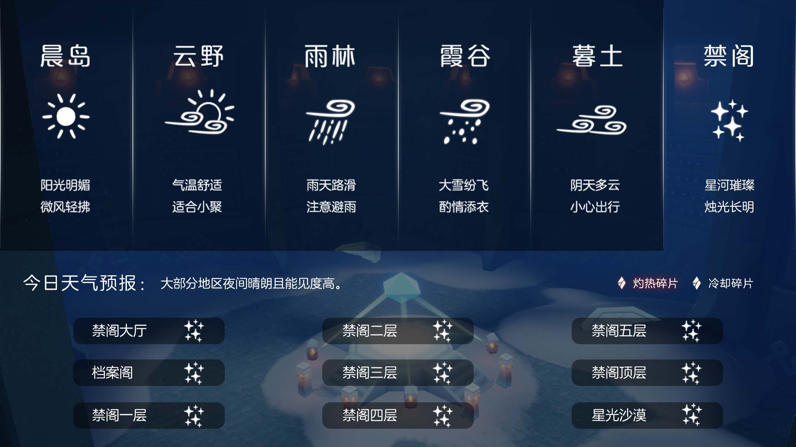

# 🌤 光遇每日任务

[](https://github.com/oivio-up/SkyDailyInfo/actions/workflows/update-daily.yml)

自动获取并展示《光·遇》每日任务和活动信息。

**[打开每日旅行手册 →](https://oivio-up.github.io/SkyDailyInfo/)** · 支持手机浏览、任务勾选、天气与图片攻略。

## 💡 项目说明

本项目通过 **Cloudflare Worker** 中转 API 请求，使用 **GitHub Actions** 每日自动更新，将光遇的每日任务和活动信息展示在 README 中。

### 特性

- ✨ 每日自动更新任务和活动信息
- 🔒 敏感数据（UID、Token）安全存储在 Cloudflare
- 🚀 通过 Cloudflare Worker 中转 API，保护隐私
- 📱 清晰的任务和活动展示
- 🖼️ 图片保存到仓库，避免外链代理失效
- ⏰ 北京时间每天 8:00 自动更新

---

<!-- DAILY_TASK_START -->
## 📅 2026年11月17日 每日任务

> 最后更新: 2026年11月17日 14:36:33 (北京时间)

### 🎯 今日旅行指南

```
【今日旅行指南】
1. 和陌生人一起坐在长凳上
2. 点燃20根蜡烛
3. 净化10株黑暗植物
4. 帮助谦逊舞者
```

### 🌤️ 天气预报

天气播报：今日无碎片降落




### 📅 本月日历


### 📖 任务详细攻略


#### 📍 每日任务－帮助谦虚舞者

【每日任务－帮助谦虚舞者】
请旅人先查看接到的任务名称，然后在下方选择对应指南
在圆梦村剧场找到谦虚舞者　｜　谦虚舞者在圆梦村需要帮助
小精灵提示：
1、若旅人从未收集过该先祖，任务会显示为：在圆梦村剧场找到谦虚舞者；
2、若旅人之前已收集过该先祖，任务会显示为：谦虚舞者在圆梦村需要帮助


---


#### 📍 季节蜡烛探索指南

https://h5.ds.163.com/v1/6ad585a083a764003172a423/?utm_content=f_ma75.jl.jlct.default.9v9w70&utm_bothash=ma75_bot_367bc25a42d1935a6e04c90df3bd91be


---


### 🎪 今日活动

今日暂无特殊活动

---

<!-- DAILY_TASK_END -->
