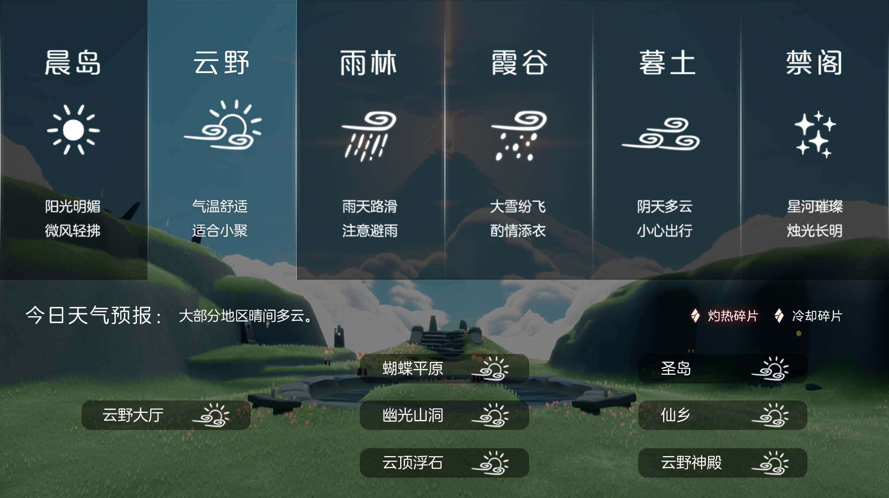
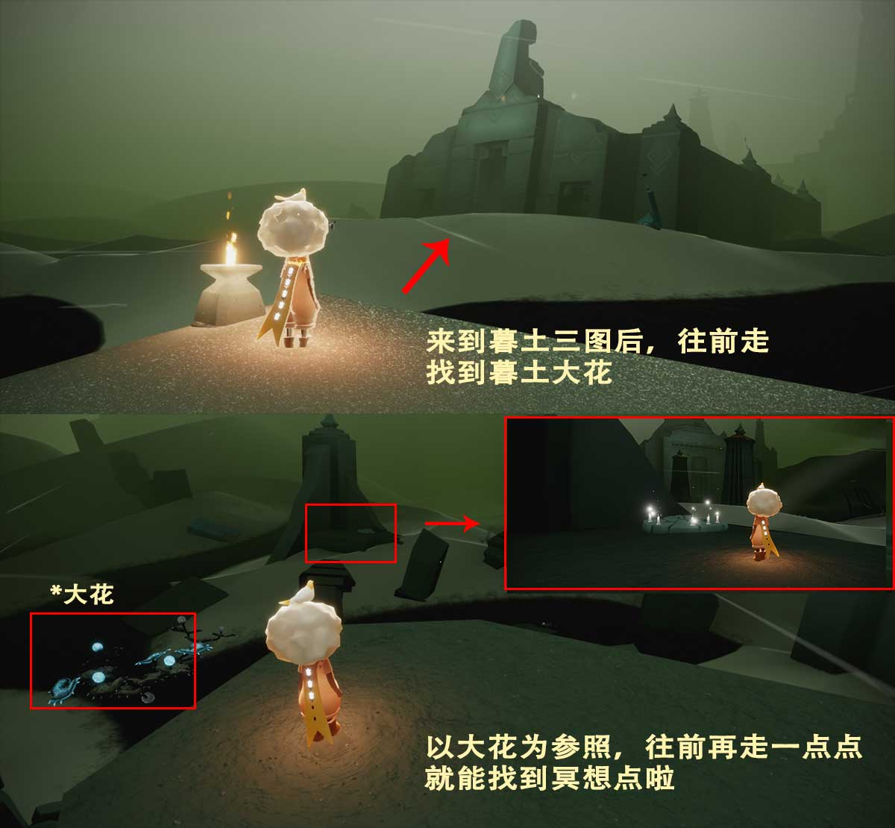

# 🌤 光遇每日任务

[](https://github.com/oivio-up/SkyDailyInfo/actions/workflows/update-daily.yml)

自动获取并展示《光·遇》每日任务和活动信息。

**[打开每日旅行手册 →](https://oivio-up.github.io/SkyDailyInfo/)** · 支持手机浏览、任务勾选、天气与图片攻略。

## 💡 项目说明

本项目通过 **Cloudflare Worker** 中转 API 请求，使用 **GitHub Actions** 每日自动更新，将光遇的每日任务和活动信息展示在 README 中。

### 特性

- ✨ 每日自动更新任务和活动信息
- 🔒 敏感数据（UID、Token）安全存储在 Cloudflare
- 🚀 通过 Cloudflare Worker 中转 API，保护隐私
- 📱 清晰的任务和活动展示
- 🖼️ 图片保存到仓库，避免外链代理失效
- ⏰ 北京时间每天 8:00 自动更新

---

<!-- DAILY_TASK_START -->
## 📅 2026年11月28日 每日任务

> 最后更新: 2026年11月28日 14:21:05 (北京时间)

### 🎯 今日旅行指南

```
【今日旅行指南】
1. 点燃20根蜡烛
2. 向一位玩家招手
3. 和朋友击掌
4. 在远古战场中央冥想
```

### 🌤️ 天气预报

天气播报：今日无碎片降落




### 📅 本月日历


### 📖 任务详细攻略


#### 📍 每日任务－在远古战场中央冥想

【每日任务－在远古战场中央冥想】
任务：在远古战场中央冥想
位置：在暮土－远古战场(暮土三图)
步骤：进入暮土后一直往前走，前往暮土三图；到达暮土三图后，找到大花，冥想点就在大花再前一点的地方~
 今日推荐：还有人不知道要这样玩吗https://ds.163.com/feed/6af8f827446a4f1a70948057/?utm_content=f_ma75.jl.jlctPT.top.nn664q&utm_term=wyds_dl_jl_sky3_5cb546a0d5456870b97d9424&utm_bothash=ma75_bot_367bc25a42d1935a6e04c90df3bd91be&q=每日任务－在远古战场中央冥想




---


#### 📍 季节蜡烛探索指南

https://h5.ds.163.com/v1/6ad585a083a764003172a423/?utm_content=f_ma75.jl.jlct.default.9v9w70&utm_bothash=ma75_bot_367bc25a42d1935a6e04c90df3bd91be


---


### 🎪 今日活动

今日暂无特殊活动

---

<!-- DAILY_TASK_END -->
